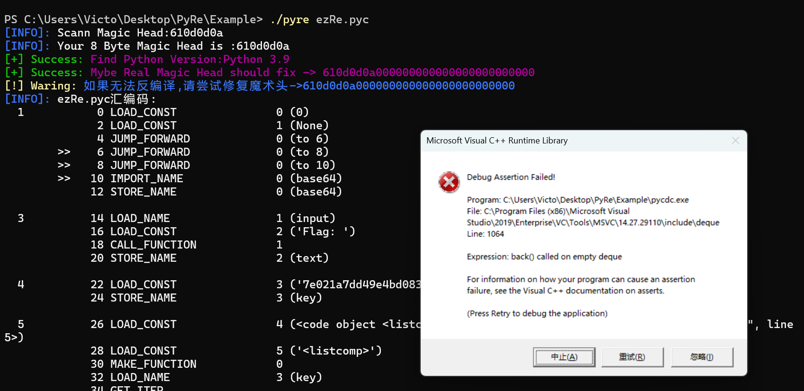
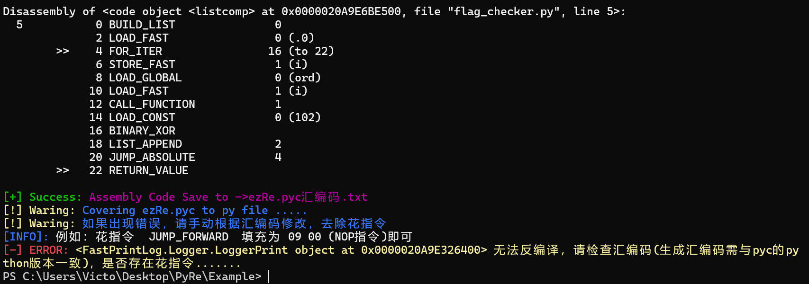
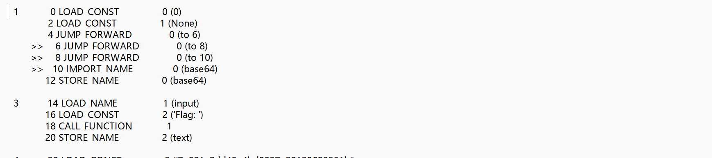
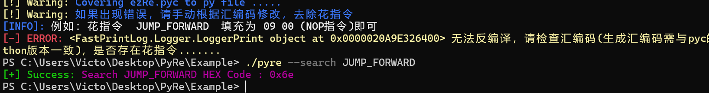
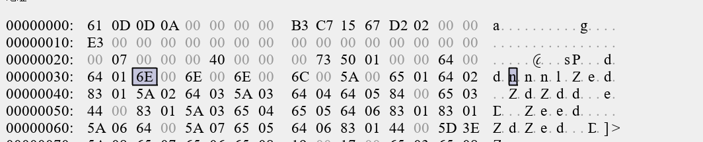
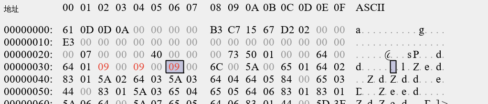
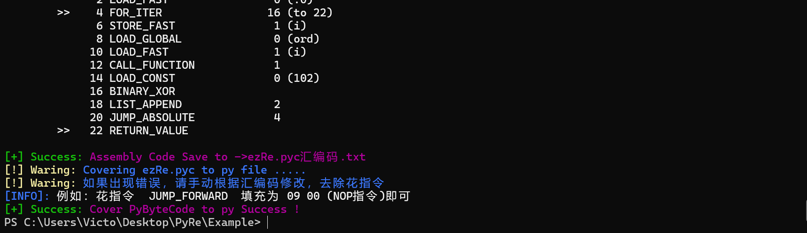
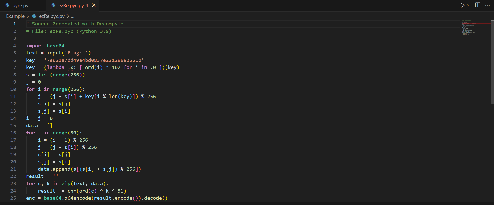
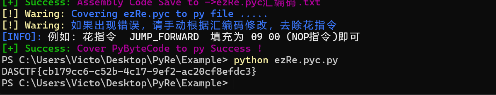

##### ezRE Writeup

```shell
./pyre ezRe.pyc  #尝试直接反编译
```



发现报错，点击终止即可。



审计汇编码



发现   JUMP_FORWARD  花指令 



搜索得到该指令字节码为 6E ， 进行NOP填充





再次反编译

```
./pyre ezRe.pyc
```



反编译成功



调整代码，获取密文，下面是POC

```python
# Source Generated with Decompyle++
# File: ezRe.pyc (Python 3.9)

import base64
key = '7e021a7dd49e4bd0837e22129682551b'
key = (lambda s: [ ord(i) ^ 102 for i in s ])(key)
s = list(range(256))
j = 0
for i in range(256):
    j = (j + s[i] + key[i % len(key)]) % 256
    s[i],s[j] = s[j],s[i]
i = j = 0
data = []
for _ in range(50):
    i = (i + 1) % 256
    j = (j + s[i]) % 256
    s[i],s[j] = s[j],s[i]
    data.append(s[(s[i] + s[j]) % 256])
result = ''
text = "w53Cj3HDgzTCsSM5wrg6FMKcw58Qw7RZSFLCljRxwrxbwrVdw4AEwqMjw7/DkMKTw4/Cv8Onw4NGw7jDmSdcwq4GGg=="
text = base64.b64decode(text).decode()
for c, k in zip(text, data):
    result += chr(ord(c) ^ 51 ^ k)
print(result)

```

成功获取flag

